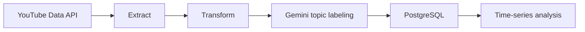

# YT TimeSeries 🚀

YT TimeSeries is a Python ETL project that collects YouTube video metadata for a defined set of channels, transforms the data into analytics-friendly features, and stores the results in PostgreSQL for time-series analysis.

This repository supports my Final Year Project (FYP). The main application lives in another repository, while this one focuses on the data pipeline, database layer, and automation.

The pipeline pulls recent uploads from the YouTube Data API, detects whether each video is a Short or a regular video, enriches missing topic labels with Gemini, and writes the transformed records into a PostgreSQL table.

## What this project does 📊

1. Extracts video IDs and metadata from selected YouTube channels.
2. Loads cached platform/topic values from PostgreSQL to avoid repeating work.
3. Transforms the raw data into derived fields such as publish hour, day, month, duration buckets, engagement rate, and days since published.
4. Uses Gemini to classify missing topics for Malaysian news titles.
5. Inserts the final dataset into `video_metrics_time_series_transformed`.
6. Runs database backup and daily update automation through GitHub Actions.

## Tech Stack 🛠️

- Python 3.10+
- Pandas for data transformation
- YouTube Data API for metadata extraction
- PostgreSQL with Supabase for storage
- Google Gemini API for topic classification
- Jupyter for notebook-based exploration
- GitHub Actions YAML workflows for scheduled updates and backups

## Repository Layout 📁

- `logic/` - pipeline orchestration
- `etl/` - extract, transform, and load steps
- `database/` - PostgreSQL connection, schema, and backup script
- `config/` - application settings and API configuration
- `.github/workflows/` - YAML automation for daily updates and backups
- `test/` - connection test and notebook-based experimentation

## Data Flow 🔁

## Main Workflow ⚙️

The main entry point is `logic/pipeline.py`. It:

- loads cached platforms and topics from PostgreSQL,
- fetches recent videos for the configured channel IDs,
- transforms the raw rows into a structured dataframe,
- labels missing topics with Gemini,
- inserts the final rows into PostgreSQL.

## YAML Automation 🤖

This project includes GitHub Actions workflows in YAML format:

- `.github/workflows/daily_update.yml` runs the pipeline on a daily schedule and can also be triggered manually.
- `.github/workflows/db_backup.yml` creates a database backup on demand.

These workflows are responsible for automating the recurring ETL run and preserving database backups in CI.

## Configuration 🔐

Set the following environment variables before running the pipeline:

- `DATABASE_URL`
- `YOUTUBE_API_KEY`
- `GEMINI_API_KEY`

The channel list, date cutoff, throttling, and transformation settings live in `config/settings.py`.

## Database Tables 🗄️

The schema defines two tables:

- `video_metrics_time_series` for raw video metadata
- `video_metrics_time_series_transformed` for transformed and enriched records

## Running Locally 💻

1. Create and activate a Python virtual environment.
2. Install dependencies with `pip install -r requirements.txt`.
3. Configure the environment variables listed above.
4. Initialize the database schema.
5. Run the pipeline with `python -m logic.pipeline`.

## Notes 📝

The project is designed around Malaysian news content, with topic labeling rules tuned for that domain. The pipeline also caches previously seen platform and topic values in PostgreSQL to reduce repeated API work.